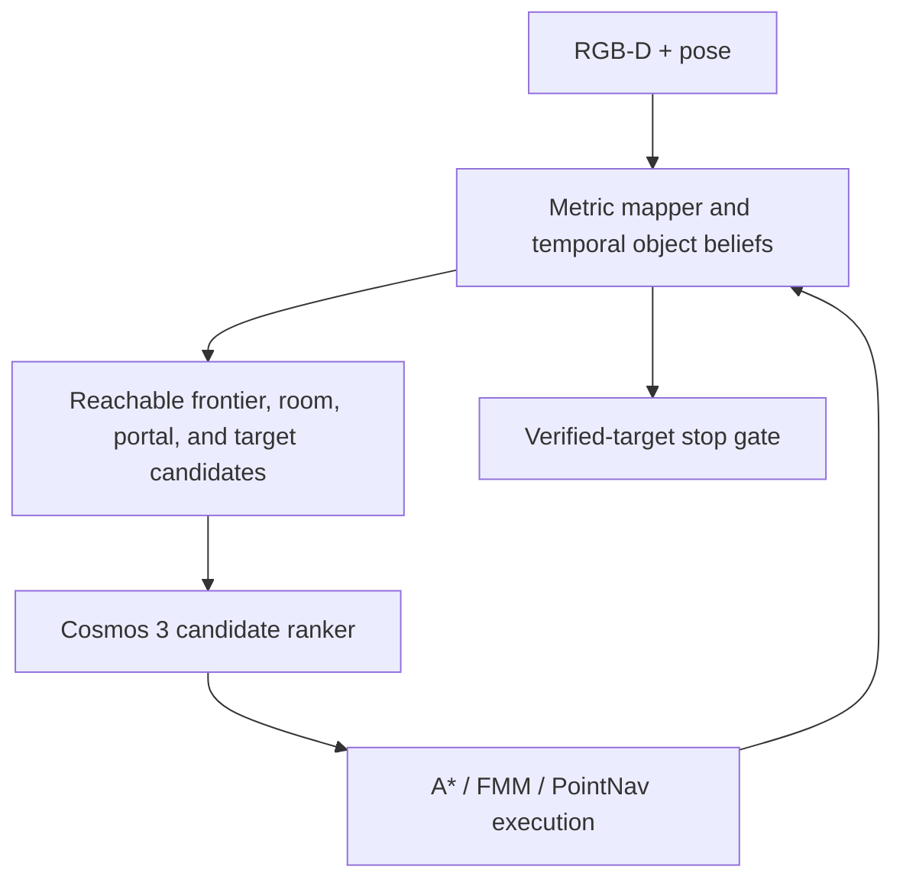

# Making Cosmos 3 Work for Object Navigation in Habitat HM3D-v2

## Deep research report and implementation blueprint

**Research cutoff:** July 19, 2026  
**Task assumed:** Habitat ObjectNav on HM3DSem v0.2 / HM3D-v2 validation, using RGB-D and pose or GPS+Compass, with Cosmos 3 currently prompted zero-shot using a map.

---

## Executive conclusion

Your result is not surprising, and it does not imply that Cosmos 3 is a weak model. The core problem is the interface and the missing navigation system around the model.

Cosmos 3 is a general physical-AI foundation model, not a pretrained Habitat ObjectNav policy. More specifically, NVIDIA's released configurations show that the Cosmos 3 Nano Reasoner is based on **Qwen3-VL-8B-Instruct**, while Super uses **Qwen3-VL-32B-Instruct**; both use a Qwen3-VL-style 27-layer visual encoder. A rendered occupancy or semantic map is therefore processed as an ordinary image unless the model is explicitly taught the map's symbols, coordinate system, candidate semantics, action space, and temporal update rules. The model may understand individual objects and rooms while still failing to maintain metric state, explore systematically, or stop correctly.

The strongest HM3D-v2 literature reaches the same conclusion from several directions:

1. **Do not ask a zero-shot VLM to emit low-level actions.** Let it rank a small set of reachable, labeled subgoals—frontiers, rooms, portals, or a verified target—and let a conventional planner/controller execute the choice.
2. **Make spatial state explicit and persistent.** Use a BEV occupancy/exploration map or a room-viewpoint-object graph. Give the VLM a stable agent-centric crop, explicit legend, candidate IDs, candidate views, and numerical relative geometry.
3. **Separate semantic exploration from geometric coverage.** When the VLM has a sharp, credible semantic preference, exploit it. When its scores are flat or inconsistent, fall back to information gain, nearest-frontier coverage, or a tour planner.
4. **Treat object detection as a temporal belief, not a single-frame event.** Fuse detections across views, verify confusing classes, localize the mask in 3D, generate a reachable approach pose, and permit `STOP` only through a deterministic verified-target gate.
5. **Use Cosmos sparsely at semantic decisions.** Query it when a room/frontier choice changes, a target needs verification, or progress stalls—not for every 0.25 m action.

The most revealing result is from [IntentNav](https://arxiv.org/html/2606.08029v1). On HM3D-v2, a VLM that predicts action tokens from egocentric history achieved **35.4 SR / 14.2 SPL**. Using the same problem as a BEV candidate-selection task improved random selection to **58.7 / 22.3**, free-form coordinate prediction to **68.4 / 26.9**, and reserved candidate-ID selection to **82.2 / 38.5**. The representation and output interface contributed more than replacing the backbone with a larger general VLM is likely to contribute.

**Recommended direction:** first build a frozen-Cosmos candidate-ranking system with strong mapping, temporal object verification, hybrid exploration, and metric control. Once that baseline is reliable, LoRA-post-train only the Cosmos Reasoner to output one reserved candidate ID. Do not begin with end-to-end action generation.

---

## 1. What HM3D-v2 actually tests

The official Habitat 2023 ObjectNav setup uses HM3DSem v0.2, with 216 semantic scenes split 145/36/35 for train/validation/test and six goal classes: **chair, couch, potted plant, bed, toilet, and TV**. The standard agent has RGB-D and noiseless GPS+Compass. Success requires the agent to issue `STOP` within 1 m Euclidean distance of a target instance from a location where an oracle can view it. The official challenge states that the episodes do **not** require traversal between floors. See the [Habitat 2023 challenge definition](https://aihabitat.org/challenge/2023/) and [HM3DSem v0.2 dataset page](https://aihabitat.org/datasets/hm3d-semantics/).

Common paper configurations use 640×480 RGB-D, 0.25 m forward actions, 30-degree turns, a 500-step limit, and 1,000 validation episodes across 36 scenes. Confirm these values against your exact Habitat config before comparing numbers.

This distinction matters:

- If your validation episodes require cross-floor travel, you are not evaluating the standard HM3D-v2 ObjectNav episode set.
- HM3D-v1 and HM3D-v2 numbers are not interchangeable. The scene split, episode set, and difficulty differ.
- “Zero-shot” is used inconsistently. In training-free systems it usually means no navigation-policy training; in learned systems it may mean that a model trained on MP3D navigation transfers to HM3D without HM3D fine-tuning.
- A method can be “training-free” at the semantic-policy level while still using a heavily pretrained detector, segmenter, frontier network, or PointNav controller.

Use both Success Rate (SR) and Success weighted by Path Length (SPL). SR measures task completion; SPL also penalizes inefficient paths. Add diagnostic metrics later in this report because SR/SPL alone cannot tell whether the failure came from seeing the object, choosing where to search, reaching a waypoint, or stopping.

---

## 2. Why raw zero-shot Cosmos 3 fails on a map

### 2.1 Cosmos 3 is a foundation model, not a Habitat policy

[NVIDIA's Cosmos 3 repository](https://github.com/nvidia/cosmos) describes an omnimodal Mixture-of-Transformers architecture with an autoregressive Reasoner and a diffusion Generator. The Reasoner accepts text, images, and video and produces text; the Generator supports continuous image, video, audio, and action generation. NVIDIA explicitly provides post-training workflows for adapting the model to domains and embodiments rather than claiming that the base checkpoint directly implements arbitrary robot action spaces. See the [official Cosmos 3 overview](https://developer.nvidia.com/blog/develop-physical-ai-reasoning-world-and-action-models-with-nvidia-cosmos-3/).

The public model configurations are even more informative:

- [Cosmos3-Nano config](https://huggingface.co/nvidia/Cosmos3-Nano/blob/main/config.json): Reasoner initialized from Qwen3-VL-8B-Instruct; 27-layer, 1,152-wide visual encoder; 36-layer, 4,096-wide language stack.
- [Cosmos3-Super config](https://huggingface.co/nvidia/Cosmos3-Super/blob/main/config.json): Reasoner initialized from Qwen3-VL-32B-Instruct; the same visual-encoder depth/width family; 64-layer, 5,120-wide language stack.

Thus your observation that Cosmos behaves similarly to Qwen is structurally well founded. A larger Reasoner can improve semantic judgment, but it does not automatically create the inductive biases that ObjectNav needs.

### 2.2 One map prompt silently asks the model to solve many untrained tasks

When a zero-shot Cosmos prompt contains a map and asks for an action, the model must infer all of the following at once:

- the color legend and whether colors are semantic or decorative;
- world coordinates versus image pixels;
- map north versus agent heading;
- occupied, free, unknown, explored, and unreachable space;
- which frontier pixels are valid reachable subgoals;
- scale and metric distance;
- temporal changes since the previous map;
- what has already been searched;
- which action vocabulary the simulator accepts;
- how many low-level actions should be committed before replanning;
- when an object hypothesis is strong enough to approach;
- the benchmark's exact stopping rule.

Pretraining gives Cosmos excellent priors about what rooms may contain a toilet or a bed. It does not guarantee pixel-accurate BEV geometry, persistent map bookkeeping, collision-free control, or Habitat-specific termination.

### 2.3 A raw map is also a visual-domain mismatch

Natural-image VLM encoders are trained primarily on perspective images, documents, diagrams, and video. A sparse raster occupancy map has different statistics: small colored regions, hard symbolic boundaries, tiny labels, and a coordinate system that may rotate or rescale. Several navigation papers overcome this by adding explicit text labels, candidate markers, separate map and RGB encoders, relative-position embeddings, or by keeping VLM reasoning in the original RGB image plane.

The implication is practical: **prompt wording alone cannot fully fix a representation mismatch**. A better prompt can reduce format failures, but large gains require a better decision interface or lightweight navigation grounding.

---

## 3. State of the art on HM3D-v2

The following values are reported by the cited primary papers. They are useful for understanding design trends but are not perfectly apples-to-apples: papers may use different detector versions, low-level controllers, prompt models, or reimplemented baselines.

### 3.1 Training-free or navigation-policy-free VLM systems

| Method | Main representation and VLM role | HM3D-v2 SR / SPL (%) | Core lesson |
|---|---|---:|---|
| [VLFM](https://ar5iv.labs.arxiv.org/html/2312.03275v1) | 2D occupancy plus BLIP-2 semantic value map; VLM scores directions | 63.5 / 32.5 in later v2 evaluation | Project VLM semantics into a persistent metric map; keep control separate. |
| [SG-Nav](https://proceedings.neurips.cc/paper_files/paper/2024/file/098491b37deebbe6c007e69815729e09-Paper-Conference.pdf) | Online hierarchical 3D scene graph; LLM/VLM scores graph regions and re-verifies goals | 49.6 / 25.5 | Object/room structure and re-perception help, but graph quality inherits detector errors. |
| [ApexNav](https://arxiv.org/html/2504.14478v3) | Probabilistic grid, semantic value map, adaptive semantic/geometric frontier policy, temporal object fusion | **76.2 / 38.0** | Use semantics only when confident; otherwise explore geometrically. Fuse target evidence over time. |
| [WMNav](https://arxiv.org/abs/2503.02247) | World-model/VLM-guided exploration with persistent navigation state | 72.2 / 33.3 | Predictive semantic priors help only when grounded into explicit navigation memory. |
| [PIGEON](https://arxiv.org/html/2511.13207v1) | Semantically meaningful Points of Interest with multi-view snapshot memory; VLM selects a PoI and a lower planner executes it | 79.2 / 36.8 | Preserve visual context at sparse reachable locations instead of asking the VLM to reason over raw frontier geometry. |
| [STRIVE](https://arxiv.org/html/2505.06729v2) | Room-viewpoint-object graph; VLM mainly chooses rooms and verifies targets | **79.6 / 38.7** | Query the VLM at semantic transitions; use deterministic within-room coverage. |
| [SysNav](https://arxiv.org/html/2603.06914v1) | Three-level room/viewpoint/object system; VLM at room level, classical coverage below | **80.8 / 37.2** | Systematic coverage plus sparse high-level VLM reasoning is a strong zero-shot design. |
| [OpenFrontier](https://arxiv.org/html/2603.05377v3) | Sparse frontiers detected and marked directly in RGB; VLM reweights information gain | **77.3 / 35.6** | A good grounded interface reduces sensitivity to the VLM backbone itself. |

Among the papers above, SysNav reports the highest training-free HM3D-v2 SR in the collected comparison, while STRIVE has slightly higher reported SPL. OpenFrontier is especially relevant to Cosmos because it tested multiple interchangeable VLMs: LLaVA-1.6, InternVL3.5-8B, Gemma-3-4B, and Gemini-2.5-Flash produced only a small spread compared with the improvement from the visual-frontier interface. At a matched backbone, the system design dominated model choice.

### 3.2 Navigation-trained VLM policies

| Method | Training and interface | HM3D-v2 SR / SPL (%) | Interpretation |
|---|---|---:|---|
| [Uni-NaVid](https://arxiv.org/abs/2412.06224) | Navigation-trained video VLM/action policy | 73.7 / 37.1 | Direct policies can work, but need navigation data and temporal design. |
| [FiLM-Nav](https://arxiv.org/html/2509.16445v2) | Cobra/Mamba VLM selects labeled frontier images; trained on ObjectNav, OVON, ImageNav and spatial tasks | **77.0 / 41.3** | Candidate choice can be learned efficiently; strong path efficiency. |
| [IntentNav](https://arxiv.org/html/2606.08029v1) | InternVL3-2B with separate BEV/RGB routing, explicit geometry, reserved candidate tokens; trained on MP3D human demos | **82.2 / 38.5** | Best evidence for candidate-level grounding; HM3D is zero-shot domain transfer, not training-free navigation. |
| [VLingNav](https://arxiv.org/html/2601.08665v1) | LLaVA-Video-7B VLA with adaptive reasoning, visual-assisted language memory, large-scale SFT and online expert-guided RL | **83.0 / 40.5** | High ceiling from large navigation-specific data and recovery training, but much greater cost. |

FiLM-Nav's 41.3 SPL is slightly higher than VLingNav's cited 40.5, whereas VLingNav reports the highest SR in this set. IntentNav is the cleanest reference for adapting Cosmos because it isolates the benefit of the map/candidate interface and uses parameter-efficient training. VLingNav is better viewed as evidence for the later, large-scale end-to-end path.

---

## 4. How the strongest systems actually make VLM navigation work

### 4.1 VLFM: semantic value maps plus a trained controller

[VLFM](https://ar5iv.labs.arxiv.org/html/2312.03275v1) is an important early template. Depth and odometry build a 2D occupancy map. Boundaries between explored and unknown space become frontiers. BLIP-2 scores the current view against a target-related prompt; the score is projected into a persistent value map with confidence weighting based on field-of-view geometry. A detector and segmentation model handle target localization, while a pretrained PointNav policy executes metric subgoals.

The crucial lesson is often missed: VLFM is zero-shot for the semantic ObjectNav decision, but its low-level PointNav controller was trained at large scale. Its performance does not come from one general VLM doing perception, mapping, exploration, and control.

### 4.2 OpenFMNav and InstructNav: structured semantic memory and decomposed values

[OpenFMNav](https://arxiv.org/html/2402.10670v2) uses an LLM to expand a free-form target, Grounded-SAM for open-vocabulary perception, and a multi-channel semantic score map containing object confidence, occupancy, and exploration state. Instead of showing raw map pixels to the language model, it summarizes candidate frontiers with observed objects and asks the model to score them; FMM executes the selected goal. Its ablations show that chain-of-thought, scene-specific object discovery, and explicit frontier scoring all contribute.

[InstructNav](https://arxiv.org/html/2406.04882v1) goes further by separating four value sources—action, semantic, trajectory, and intuition—then combining and obstacle-masking the maps before selecting a waypoint. This avoids expecting one VLM response to simultaneously express target semantics, visit history, collision constraints, and low-level execution.

The general pattern is to turn unstructured VLM knowledge into one bounded term inside a navigation objective.

### 4.3 SG-Nav: scene graph reasoning plus re-perception

[SG-Nav](https://proceedings.neurips.cc/paper_files/paper/2024/file/098491b37deebbe6c007e69815729e09-Paper-Conference.pdf) builds a hierarchical 3D graph of objects, groups, and rooms, aligned with a 2D occupancy map. Language models prune and score relationships; a VLM verifies local edges. Its re-perception mechanism accumulates target credibility over repeated observations and abandons false candidates.

On HM3D-v1, removing graph reasoning and re-perception reduced SR from roughly 54 to 39; adding the graph recovered most of the loss, and re-perception added the final improvement. This is strong evidence that a persistent object belief and target rejection mechanism are not optional details.

### 4.4 ApexNav: adaptive exploration and temporal object fusion

[ApexNav](https://arxiv.org/html/2504.14478v3) directly targets the two failures you named.

For exploration, it maintains a probabilistic free/occupied/unknown grid and a BLIP-2 semantic map. It measures whether frontier semantic scores are sufficiently strong and non-uniform. If they are, it enters semantic mode and plans an efficient asymmetric tour through high-value frontiers. If not, it falls back to geometric nearest-frontier exploration. This prevents weak VLM priors from causing oscillation or long detours. Its reported HM3D-v2 result is 76.2 SR / 38.0 SPL; the adaptive semantic-tour/geometric-greedy combination outperformed semantic-only and geometry-only variants.

For objects, ApexNav asks an LLM for aliases, confusing classes, likely rooms, and class-specific detector thresholds. Detections are segmented, lifted into 3D, clustered, and fused over time. A missing detection penalizes an object hypothesis only when the object should have been visible. Suspected targets are not immediately treated as confirmed goals. Safe waypoints and an obstacle-distance cost reduce controller failures.

### 4.5 STRIVE and SysNav: put the VLM at the room level

[STRIVE](https://arxiv.org/html/2505.06729v2) maintains a three-layer room-viewpoint-object graph. It distinguishes true room-boundary frontiers from occlusion-created inner frontiers. Within a room, geometry and coverage determine the next viewpoint. The VLM is called mainly to decide whether continued local search is worthwhile, which room to visit next, and whether a target observation is contextually valid. It reports 79.6 / 38.7 on HM3D-v2.

[SysNav](https://arxiv.org/html/2603.06914v1) uses a similar hierarchy: high-level semantic reasoning, mid-level room coverage, and low-level autonomy. Rooms, viewpoints, and objects form a persistent graph. The VLM makes sparse room-level choices, while deterministic coverage and route planning handle the rest. It reports 80.8 / 37.2.

These methods exploit what VLMs are good at—room/object commonsense and scene interpretation—without asking them to do pixel-scale navigation.

### 4.6 OpenFrontier: keep zero-shot reasoning in the RGB image plane

[OpenFrontier](https://arxiv.org/html/2603.05377v3) offers a second strong option when BEV-map understanding is unreliable. A learned FrontierNet detects frontier-like openings directly in the current RGB image and estimates their information gain. The candidates are marked with letters in the image. A VLM assigns goal-relevance probabilities to those visual anchors; the probabilities reweight geometric information gain. The selected 2D point is lifted into 3D and sent to a PointNav controller.

This lets the VLM reason in a familiar natural-image domain while maintaining sparse global frontier memory outside the model. On HM3D-v2 it reports 77.3 / 35.6 with Gemini-2.5-Flash; changing the VLM to smaller or older models produced much less variation than changing the navigation interface. The system queries frontier reasoning every six steps rather than on every action.

For Cosmos, this is the best immediate zero-shot experiment: compare the same Cosmos checkpoint on (a) your raw BEV prompt and (b) set-of-marks frontier selection in RGB. If the latter is much better, the problem is map grounding rather than general semantic ability.

[PIGEON](https://arxiv.org/html/2511.13207v1) reaches a similar interface from a different direction. It stores semantically meaningful, reachable Points of Interest as multi-view RGB snapshots, lets the VLM select among those snapshots, and uses a lower-level planner for execution. Its reported GPT-4o zero-shot configuration reaches 79.2 / 36.8 on HM3D-v2. A Qwen2.5-VL-7B version is further trained with verifiable rewards based on which PoI produces the shortest path toward the goal. The zero-shot result reinforces the representation argument; the RL result shows how candidate-level rewards can improve path efficiency without learning low-level control.

A very recent alternative, [ReMemNav](https://arxiv.org/html/2603.26788v1), marks safe depth-derived action rays in panoramic RGB, uses a bounded episodic memory, and invokes a second “rethink” mode to verify targets or escape local deadlocks. Its Qwen3-VL ablations show that memory and rethinking help, while unverified dense semantic tags can increase premature false-positive stops. Its reported HM3D-v0.2 protocol uses a 40-decision limit rather than the standard 500 discrete-step setup used by many other papers, so its numbers should not be inserted directly into the main comparison table.

### 4.7 FiLM-Nav and IntentNav: learn candidate selection, not action prose

[FiLM-Nav](https://arxiv.org/html/2509.16445v2) passes a short visual history and a representative RGB image for each labeled frontier to a 2.8B Mamba VLM. The model outputs exactly one frontier label. It trains on a mix of ObjectNav, OVON, ImageNav, and an auxiliary spatial task; low-level PointNav remains separate. This achieves 77.0 / 41.3 on HM3D-v2.

[IntentNav](https://arxiv.org/html/2606.08029v1) is more directly relevant to map encoders. It builds a persistent BEV with occupancy, exploration, trajectory, frontiers, and verified targets. Every candidate has:

- a current candidate ID;
- an agent-centric BEV location;
- explicit distance and relative bearing;
- the first egocentric RGB view observed when that candidate appeared.

It uses separate BEV and egocentric visual branches initialized from the same pretrained encoder, independent LoRA adaptation, explicit 2D position injection, and a pairwise spatial encoder. Thirty-two reserved candidate-ID tokens turn generation into constrained classification. The base model is InternVL3-2B, whose language component is Qwen2-based.

It is trained for three epochs on 2.36 million candidate states derived from 23,767 MP3D Habitat-Web human demonstrations, then evaluated on HM3D without domain fine-tuning. Important HM3D-v2 ablations are:

| Variant | SR / SPL (%) |
|---|---:|
| Egocentric RGB history → action token | 35.4 / 14.2 |
| BEV candidate space → random candidate | 58.7 / 22.3 |
| BEV candidate space → free-form text coordinate | 68.4 / 26.9 |
| BEV + visual memory + geometry → reserved candidate ID | **82.2 / 38.5** |
| Without frontier visual memory | 70.2 / 29.4 |
| Without pairwise geometry | 76.4 / 33.7 |
| Without reserved candidate tokens | 78.6 / 35.1 |
| Oracle frontier semantics | 84.6 / 40.2 |

The result says three things about your Cosmos setup: the map must be grounded, each waypoint needs visual evidence, and output generation must be constrained.

### 4.8 MapNav: explicit map annotation and modality-specific projection

[MapNav](https://arxiv.org/html/2502.13451v3) studies VLN-CE rather than HM3D ObjectNav, so its benchmark numbers are not directly comparable. Its representation is still valuable. RGB-D, pose, and segmentation are projected into a semantic map containing obstacles, explored space, agent pose, trajectory, and objects. Connected components are labeled with readable object names, producing an Annotated Semantic Map.

The current RGB and map pass through a shared SigLIP encoder but separate two-layer MLP projectors before reaching a Qwen2-7B language model. Adding the annotated map improved R2R-CE val-unseen SR from 27.1 to 36.5 in its single-current-frame comparison and kept memory constant over time. The lesson is not to copy its free-form low-level action output; it is to make the map visually and linguistically legible and distinguish map features from camera features.

### 4.9 VLingNav: what full end-to-end training requires

[VLingNav](https://arxiv.org/html/2601.08665v1) uses a LLaVA-Video-7B policy with temporal sampling, adaptive chain-of-thought, visual-assisted linguistic memory, supervised fine-tuning, and online expert-guided reinforcement learning. Its training corpus combines roughly 2.9 million navigation samples with 1.6 million general video examples; reasoning annotations are generated by a much larger Qwen2.5-VL model. Expert recovery trajectories are added when the policy becomes stuck or fails.

The system reports 83.0 / 40.5 on HM3D-v2, but the cost and data requirements are in a different class from a frozen VLM system. Its most transferable lessons are that memory must contain both language and selected visual evidence, dense reasoning at every step can be harmful, and on-policy recovery data is needed to fix compounding errors.

---

## 5. Representation and encoder design: what to feed Cosmos

### 5.1 Preferred state representation

Use two complementary spatial representations outside Cosmos:

1. **Metric BEV per floor** for occupancy, explored space, trajectory, frontiers, target hypotheses, and path planning.
2. **Sparse topology** for rooms, viewpoints, objects, and floor-transition portals.

Do not flatten multiple floors into one 2D raster. Maintain one occupancy layer per floor and connect floors through stair/elevator portal nodes. Standard HM3D-v2 does not require floor changes, but this avoids a future architectural dead end and allows the same code to handle full HM3D buildings or real deployments.

### 5.2 The VLM should see candidates, not the whole action space

At each high-level decision, construct at most 8–16 valid candidates:

- clustered reachable frontiers;
- one or more room/doorway/stair portals;
- verified target approach poses;
- optionally an in-place scan/recovery option.

For each candidate provide:

| Field | Why it matters |
|---|---|
| Stable within-step ID such as `<cand_3>` | Enables constrained output; avoids coordinate generation. |
| Best or first-seen RGB view | Supplies room/object semantics in a domain the vision encoder understands. |
| Marker in the BEV and/or RGB image | Binds the symbol to a physical location. |
| Relative distance and bearing | Prevents the VLM from estimating geometry from pixels. |
| Path cost and reachability | Keeps unreachable goals out of semantic reasoning. |
| Information gain / unknown area | Gives an explicit exploration prior. |
| Room label and observed object summary | Supports commonsense object-room reasoning. |
| Visit count, last-visit time, failure flag | Reduces loops and repeated failed attempts. |
| Floor ID and portal type | Required for multi-floor operation. |

### 5.3 Three encoder options

**Option A — Frozen Cosmos, no new encoder: recommended first.** Render one fixed-style agent-centric BEV crop with large labels and a legend, plus separate candidate RGB images. Put numeric geometry in text/JSON. Constrain decoding to candidate IDs. This is the fastest way to determine the ceiling of Cosmos's existing visual features.

**Option B — Separate map/RGB adapters with LoRA: recommended production direction.** Route BEV and egocentric images through separate visual adapters or separate LoRA parameter sets, even if both initialize from Cosmos's Qwen3-VL vision encoder. Add a small MLP for relative polar geometry and 2D candidate positions, inject these embeddings next to each candidate token, and LoRA-tune the Reasoner. This follows the strongest part of IntentNav while preserving Cosmos pretraining.

**Option C — Full end-to-end VLA: later research path.** Predict short waypoint trajectories or continuous actions through Cosmos's action pathway only after collecting broad navigation demonstrations and on-policy recovery data. This is much more expensive and makes diagnosis harder.

### 5.4 Map rendering rules for a frozen model

Use a fixed coordinate convention and never rotate it unpredictably. An agent-centric crop is usually easiest: agent at center, heading always up. Include a visible legend in every image:

- unknown: gray;
- free: white;
- occupied: black;
- explored frontier: green contour/marker;
- trajectory: blue;
- agent and heading: red arrow;
- target hypothesis: orange;
- rooms/portals: labeled boundaries;
- candidate IDs: large high-contrast labels with non-overlapping boxes.

Keep tiny textures and dense semantic colors out of the VLM image. Store rich semantics in structured state; render only what supports the current decision. If the global map is large, provide both a global overview and a high-resolution local crop, with the same orientation and a visible crop box.

### 5.5 A valid frozen-Cosmos decision request

The model should receive a bounded classification problem, for example:

```json
{
  "goal": "toilet",
  "agent": {"floor": 0, "heading_deg": 0},
  "observed_rooms": ["living room", "hallway"],
  "searched_rooms": ["living room"],
  "candidates": [
    {"id": "<cand_0>", "type": "frontier", "room_hint": "hallway", "distance_m": 2.8, "bearing_deg": -25, "path_cost_m": 3.2, "info_gain": 0.76, "visits": 0},
    {"id": "<cand_1>", "type": "doorway", "room_hint": "possible bathroom", "distance_m": 4.1, "bearing_deg": 48, "path_cost_m": 5.0, "info_gain": 0.52, "visits": 0}
  ],
  "allowed_output": ["<cand_0>", "<cand_1>"]
}
```

Attach the annotated BEV and one candidate RGB image per option. Request only one ID, use temperature 0, restrict the token vocabulary if your serving stack allows it, validate the output, and fall back deterministically if it is invalid.

Do not request a long chain-of-thought. If an explanation is needed for debugging, request a short structured reason separately from the control token. Recent systems increasingly find that sparse or adaptive reasoning works better than continuous verbose reasoning.

---

## 6. Recommended Cosmos3-Nav system



### 6.1 Module responsibilities

**Mapper**

- Fuse depth into a probabilistic 2D grid for each floor.
- Track free, occupied, unknown, explored, trajectory, collision, and unreachable cells.
- Inflate obstacles by the agent radius; clean isolated depth points.
- Extract reachable frontier clusters and project their goals onto free space.
- Maintain room/topological connectivity and floor portals.

**Object perception and belief**

- Use a dedicated open-vocabulary detector and segmenter—such as Grounding DINO/YOLO-World/OWL-ViT plus SAM2/SAM3—rather than relying on Cosmos to be the only detector.
- Expand goal aliases and confusable labels: TV/monitor/screen, couch/sofa, plant/potted plant, and class-specific distractors.
- Lift masks with depth to 3D; remove outliers; retain the largest plausible component.
- Cluster detections across frames by class compatibility and 3D overlap/distance.
- Fuse confidence across views. Require repeated evidence, for example two detections among the last three expected-visible observations.
- Decrease belief only when the candidate should have been visible and unoccluded.
- Create an approach waypoint on reachable free space; never navigate to a mask centroid or object surface point.

**Candidate manager**

- Filter unreachable or duplicate frontiers before the VLM sees them.
- Keep the candidate set small and diverse by angular separation, room, and information gain.
- Associate each candidate with a representative or birth-view RGB image.
- Record visit count, prior failures, semantic score history, and map change.

**Cosmos high-level policy**

- Score candidates for semantic relevance to the goal.
- Optionally choose the next room/floor before choosing a local frontier.
- Verify ambiguous target crops or room context when triggered.
- Never directly issue `move_forward`, `turn_left`, or `STOP` in the recommended first system.

**Planner/controller**

- Run A*/FMM to a short-horizon safe waypoint or use a robust PointNav policy.
- Replan after reaching the waypoint, a substantial map update, collision/stall, target-belief change, or candidate invalidation—not every action.
- Use collision recovery and blacklist repeatedly unreachable waypoints.

**Stop gate**

- `STOP` is a deterministic system action, not a general VLM suggestion.
- Require a verified class, temporally stable instance cluster, reachable same-floor approach pose, distance threshold, and optionally context verification.
- Check Habitat's actual success-distance convention in the environment state; do not infer it from the image.

### 6.2 Hybrid exploration score

A practical candidate utility is:

\[
U_i = w_s\log(p_i^{\mathrm{Cosmos}}+\epsilon) + w_g G_i - w_c C_i - w_r R_i - w_f F_i,
\]

where:

- \(p_i^{\mathrm{Cosmos}}\): semantic relevance;
- \(G_i\): geometric information gain;
- \(C_i\): A* path cost;
- \(R_i\): revisit/trajectory overlap penalty;
- \(F_i\): failure, collision, or risk penalty.

Do not always apply the same semantic weight. Measure the entropy, range, and temporal consistency of Cosmos's candidate scores:

- **Sharp, stable distribution:** use semantic mode; consider a short tour among the top candidates to reduce backtracking.
- **Flat, unstable, or invalid distribution:** use geometry mode; choose high information gain or nearest reachable frontier.
- **No valid frontier:** execute a controlled scan, relax frontier thresholds once, then resegment the local map.

This adaptive gate is one of the most likely fixes for your exploration failures.

### 6.3 Room and floor hierarchy

For larger maps, use two Cosmos decisions at different rates:

1. **Global semantic decision:** which room/floor/portal is most relevant to the object?
2. **Local geometric decision:** which viewpoint/frontier gives the best coverage inside that region?

The VLM should see global room topology only when selecting a region. It does not need a full building map during local doorway traversal. Conversely, a local RGB frontier marker is more useful than a global map when deciding which side of a corridor to enter.

---

## 7. Fixing the object failures

### 7.1 Typical causes

| Failure | Observable symptom | Required fix |
|---|---|---|
| False positive | Agent approaches/stops at monitor, picture, table plant, or unannotated lookalike | Alias/confusion model, multi-view evidence, VLM context verification, deterministic stop gate |
| False negative | Target appears small/partial but exploration continues | Multi-scale detector, class-specific thresholds, scan actions, segmentation-assisted proposals |
| Bad 3D localization | Correct detection but goal point is behind wall/on object | Mask-depth filtering, connected component, free-space approach pose, same-island check |
| Stale hypothesis | Object was glimpsed, then agent follows a wrong old location | Expected-visibility persistence check and belief decay/removal |
| Benchmark mismatch | Semantically correct object is not accepted | Log instance IDs/annotations; distinguish agent error from dataset annotation mismatch |
| Premature stop | VLM says object is present but agent is outside success region | Remove `STOP` from VLM action set; check geometry and environment distance |

### 7.2 Minimal temporal target state

Store for each object hypothesis:

- canonical class and raw detector labels;
- 3D centroid, extent, covariance, and floor;
- number of supporting views and distinct camera baselines;
- fused confidence and last-seen step;
- number of expected-visible misses;
- representative crops and context view;
- navigable approach pose and path validity;
- verification status: suspected, verified, rejected, stale.

This turns object detection into state estimation. A single high-confidence frame is not enough to terminate an episode.

### 7.3 Suggested acceptance policy

1. Detector proposes the target or a permitted alias.
2. Segmentation and depth produce a geometrically plausible 3D component.
3. Hypothesis matches across at least two recent views, or one extremely strong view plus Cosmos context verification.
4. A reachable free-space approach pose exists on the same navigable island/floor.
5. Agent approaches that pose using the metric controller.
6. During approach, the hypothesis persists when expected to be visible.
7. At the approach pose, the deterministic benchmark-distance check authorizes `STOP`.

---

## 8. Post-training Cosmos 3

NVIDIA supports Reasoner post-training and LoRA; its own guidance notes that post-training is needed for specialized domains and camera perspectives. See the [official Cosmos 3 post-training discussion](https://developer.nvidia.com/blog/post-train-nvidia-cosmos-3-in-one-day-using-agent-skills/). For ObjectNav, post-train the Reasoner as a candidate ranker, not as a language-generating motor controller.

### 8.1 Training sample

Each sample should contain:

- target category or free-form goal;
- annotated BEV/global-local crop;
- 4–16 reachable candidates;
- candidate birth/best-view images;
- distance, bearing, path cost, information gain, room/floor, visit/failure state;
- one target candidate when a verified target exists;
- correct candidate ID;
- optional labels for target validity and recovery state.

Generate samples from on-policy map states, not only oracle shortest paths. The model must learn states caused by its own imperfect exploration: partially observed rooms, wrong turns, stale detections, blocked frontiers, repeated corridors, and recovery.

### 8.2 Supervision

There are three sensible label sources:

1. **Greedy oracle frontier:** choose the reachable candidate that minimizes remaining geodesic distance or maximizes expected progress to the closest target. Easy but can overfit to privileged goal information.
2. **Human intent:** replay Habitat-Web demonstrations and label the frontier through which the demonstrator's future trajectory exits, following IntentNav. Better model of realistic search.
3. **DAgger/on-policy expert:** roll out the current Cosmos policy, then label its visited states with an oracle or stronger planner. Best for recovery and covariate shift.

A useful staged corpus is 100k–300k diverse states for the first LoRA experiment, then expand toward 1–3 million if the learning curve remains positive. FiLM-Nav demonstrates that a mixed corpus on the order of 100k navigation/spatial samples can already be useful; IntentNav uses 2.36 million states for its strongest result.

### 8.3 Model adaptation

- Reserve tokens `<cand_0>` through `<cand_31>`.
- Mask the output vocabulary to currently valid candidates.
- Freeze most of Cosmos initially.
- Apply independent LoRA to map and egocentric visual routes if possible; otherwise use modality/type embeddings and separate projectors.
- Train the candidate token head, projectors, geometry MLP, and LoRA parameters.
- Inject relative distance/bearing and candidate pixel location next to the candidate delimiter.
- Use angularly softened labels among neighboring exploration frontiers, but hard cross-entropy for verified target commitment.
- Add an auxiliary task that matches candidate views to relative coordinates or predicts pairwise spatial relations.

### 8.4 On-policy refinement

After supervised training stabilizes, collect failures from Habitat rollouts. Add expert recovery after:

- three consecutive collisions;
- revisiting the same cells without map growth;
- alternating between two candidates;
- invalidating a selected frontier;
- losing a target during approach;
- exhausting a room without selecting a new region.

If using reinforcement learning, keep the action space at candidate level. A reasonable reward combines episode success, geodesic progress, new coverage, and verified-target commitment, with penalties for path length, collisions, redundant revisits, invalid stops, and repeated VLM queries. Preserve an imitation loss during RL to prevent unstable exploration.

---

## 9. Evaluation and ablation plan

### 9.1 Instrument the failure cascade

Every failed episode should end with exactly one primary cause and any contributing causes:

1. target never visually observed;
2. detector false negative;
3. detector false positive;
4. target 3D localization or approach-pose failure;
5. frontier/map extraction failure;
6. high-level exploration choice failure;
7. local planner/controller collision or stuck failure;
8. premature/invalid stop;
9. target reached but no stop;
10. step-budget exhaustion;
11. floor/portal error;
12. annotation/evaluation mismatch.

Log the final map, trajectory, target-belief timeline, candidate set and scores at each high-level decision, planner path, collision events, and stop-gate decision. Without this separation, improving the VLM can hide a detector problem or vice versa.

### 9.2 Metrics beyond SR/SPL

- SoftSPL and distance-to-success;
- collision rate and stuck events;
- invalid-stop false-positive rate;
- verified-target precision/recall;
- target-localization error and approach-pose reachability;
- explored-area coverage;
- redundant revisit ratio;
- frontier invalid/unreachable rate;
- candidate-switch/oscillation count;
- target seen-to-stop latency;
- high-level VLM queries per episode;
- mean/95th-percentile inference latency;
- per-class and per-scene SR/SPL.

### 9.3 Highest-value ablations

Run the official 1,000-episode validation set with fixed seeds and the same detector/controller wherever possible.

| Ablation | Question answered |
|---|---|
| Raw BEV + free-form action vs candidate ID | Is the decision interface the dominant issue? |
| BEV-only candidates vs candidate RGB views | Is map-domain visual grounding insufficient? |
| Text coordinates vs explicit geometry embeddings | Is the model extracting metric relations reliably? |
| Fixed semantic weight vs adaptive semantic/geometric gate | Are weak VLM scores causing exploration failures? |
| Nearest frontier vs information gain vs semantic tour | Is the path inefficiency from ordering or candidate quality? |
| Single-frame target vs temporal fusion | How much failure comes from false target commitment? |
| Detector-only vs detector + Cosmos verifier | Does Cosmos improve precision enough to justify latency? |
| VLM stop vs deterministic stop gate | How much SR is lost to termination? |
| Query every step vs every 6 steps vs event-triggered | What is the accuracy/latency/replanning trade-off? |
| Flat map vs per-floor map + portals | Needed only for nonstandard multi-floor episodes or future deployment. |
| Cosmos Nano vs Super under identical interface | Does backbone size matter after system grounding? |
| Cosmos vs Qwen3-VL under identical interface | Does Cosmos posttraining add navigation-relevant value? |

### 9.4 Oracle decomposition

Use four diagnostic oracles to measure the ceiling of each subsystem:

- **Oracle perception:** reveal valid target proposals but keep learned exploration/control.
- **Oracle frontier selection:** choose the best current frontier but keep real perception/control.
- **Oracle controller:** teleport or follow shortest valid paths to selected waypoints.
- **Oracle stop:** stop automatically when the Habitat success condition becomes true.

The gain from each oracle quantifies where engineering time will produce the largest return. For example, a large oracle-stop gain means changing the map encoder will not solve the current bottleneck.

---

## 10. Prioritized implementation roadmap

### Phase 1 — Establish a defensible baseline

1. Freeze Cosmos 3.
2. Keep a probabilistic occupancy/exploration BEV and clean reachable frontier clusters.
3. Give each frontier a candidate ID, representative RGB view, distance, bearing, path cost, information gain, and visit count.
4. Constrain Cosmos to choose one candidate ID.
5. Add deterministic A*/FMM/PointNav execution.
6. Add a temporal object-belief table and deterministic stop gate.
7. Add failure-cascade logging and oracle evaluation.

This phase should answer whether Cosmos has useful semantic frontier priors once the interface is correct.

### Phase 2 — Fix exploration efficiency

1. Add adaptive semantic-versus-geometric gating.
2. Add room/viewpoint topology and searched-room memory.
3. Use event-triggered Cosmos calls.
4. Add oscillation/stall detection, candidate blacklisting, and controlled scan recovery.
5. Compare BEV candidate prompting with OpenFrontier-style set-of-marks RGB prompting.

### Phase 3 — Lightweight navigation grounding

1. Build candidate-level training states from HM3D-train, MP3D Habitat-Web, or both.
2. Add reserved candidate tokens, map/RGB type separation, and explicit geometry injection.
3. LoRA-tune the Cosmos Reasoner on candidate selection.
4. Add target-hard/frontier-soft loss and an auxiliary spatial task.
5. Collect on-policy errors and run one or more DAgger rounds.

### Phase 4 — Only if needed

Consider Cosmos action-generation or a full VLA policy only if the modular candidate system is already strong and your research goal specifically requires end-to-end learning. Otherwise, the extra data, compute, and loss of interpretability are unlikely to be justified.

---

## 11. Recommended baseline stack

For a practical first implementation:

| Layer | Recommended starting point |
|---|---|
| Global geometry | Depth-based probabilistic 5 cm occupancy grid, per floor |
| Topology | Room/viewpoint graph with doorway and stair portal nodes |
| Frontier extraction | Reachable clustered BEV frontiers; optionally FrontierNet RGB proposals for comparison |
| Object proposal | YOLO-World or Grounding DINO / OWL-ViT |
| Segmentation | SAM2 or SAM3 |
| Object memory | 3D instance clusters with multi-view confidence and expected-visibility decay |
| High-level policy | Cosmos 3 Reasoner selecting `<cand_i>` |
| Exploration fallback | Information gain or nearest frontier when Cosmos confidence is flat |
| Global route | A* or FMM; short safe waypoint horizon |
| Local execution | Robust PointNav or deterministic velocity controller |
| Stopping | Verified target plus geometric success check; never free-form VLM stop |
| Replanning | Waypoint reached, map/candidate invalidated, target update, or stuck event |

Start with Cosmos Nano for rapid experiments. Compare Super only after the interface is stable. OpenFrontier's backbone swap and IntentNav's 2B result both suggest that architecture and grounding can dominate raw parameter count.

---

## 12. Direct answer to “how did they make the model work?”

The best navigation papers did not make a general VLM reliable by giving it a better paragraph prompt and a raw map. They changed the problem around the model:

- maps and graphs preserve state outside the VLM;
- detectors and segmenters handle pixel-level object proposals;
- depth turns image evidence into metric 3D hypotheses;
- frontiers compress continuous exploration into a few reachable choices;
- candidate images connect map points back to natural visual semantics;
- explicit geometry removes the need for the VLM to measure pixels;
- candidate tokens eliminate free-form action ambiguity;
- temporal fusion and re-perception reject false objects;
- adaptive exploration prevents weak semantic priors from dominating;
- A*/FMM/PointNav provides collision-aware execution;
- deterministic stopping implements the benchmark rule;
- navigation-specific imitation or LoRA teaches the remaining map-to-choice relationship;
- on-policy recovery data fixes loops and compounding errors.

For your current Cosmos 3 system, the highest-return change is therefore:

> **Turn the map into a candidate generator and memory, not an image from which Cosmos must invent a complete navigation policy.**

Use Cosmos as the semantic ranker of grounded, reachable choices. That design is supported by training-free systems around 77–81% HM3D-v2 SR and by candidate-trained systems around 82–83% SR, while the direct egocentric action interface in the most diagnostic recent ablation achieved only 35.4%.

---

## Primary sources

### Cosmos and Habitat

- NVIDIA, [Cosmos 3 repository and architecture](https://github.com/nvidia/cosmos)
- NVIDIA, [Cosmos 3 official technical overview](https://developer.nvidia.com/blog/develop-physical-ai-reasoning-world-and-action-models-with-nvidia-cosmos-3/)
- NVIDIA, [Cosmos3-Nano model card and configuration](https://huggingface.co/nvidia/Cosmos3-Nano)
- NVIDIA, [Cosmos3-Super configuration](https://huggingface.co/nvidia/Cosmos3-Super/blob/main/config.json)
- Habitat, [2023 ObjectNav challenge and HM3D-v2 protocol](https://aihabitat.org/challenge/2023/)
- Habitat, [HM3DSem v0.2 dataset](https://aihabitat.org/datasets/hm3d-semantics/)

### Navigation papers

- [VLFM: Vision-Language Frontier Maps for Zero-Shot Semantic Navigation](https://ar5iv.labs.arxiv.org/html/2312.03275v1)
- [OpenFMNav: Towards Open-Set Zero-Shot Object Navigation via Vision-Language Foundation Models](https://arxiv.org/html/2402.10670v2)
- [InstructNav: Zero-Shot System for Generic Instruction Navigation](https://arxiv.org/html/2406.04882v1)
- [SG-Nav: Online 3D Scene Graph Prompting for LLM-based Zero-shot Object Navigation](https://proceedings.neurips.cc/paper_files/paper/2024/file/098491b37deebbe6c007e69815729e09-Paper-Conference.pdf)
- [ApexNav: An Adaptive Exploration Strategy for Zero-Shot Object Navigation](https://arxiv.org/html/2504.14478v3)
- [STRIVE: Structured Representation Integrating VLM Reasoning for Efficient Object Navigation](https://arxiv.org/html/2505.06729v2)
- [SysNav: Multi-Level Systematic Cooperation Enables Real-World, Cross-Embodiment Object Navigation](https://arxiv.org/html/2603.06914v1)
- [OpenFrontier: General Navigation with Visual-Language Grounded Frontiers](https://arxiv.org/html/2603.05377v3)
- [PIGEON: VLM-Driven Object Navigation via Points of Interest Selection](https://arxiv.org/html/2511.13207v1)
- [ReMemNav: A Rethinking and Memory-Augmented Framework for Zero-Shot Object Navigation](https://arxiv.org/html/2603.26788v1)
- [FiLM-Nav: Learning Frontier Selection for Object Navigation](https://arxiv.org/html/2509.16445v2)
- [IntentNav: Learning Spatial-Visual Object Navigation from Human Demonstrations](https://arxiv.org/html/2606.08029v1)
- [VLingNav: Embodied Navigation with Adaptive Reasoning and Visual-Assisted Linguistic Memory](https://arxiv.org/html/2601.08665v1)
- [MapNav: Annotated Semantic Maps for VLM-based Vision-and-Language Navigation](https://arxiv.org/html/2502.13451v3)
- [HM3D-OVON: Open-Vocabulary Object Goal Navigation](https://arxiv.org/abs/2409.14296)

---

## Final recommendation

Build and evaluate the frozen candidate-ranking architecture before spending compute on full fine-tuning. If the candidate interface plus temporal target verification does not substantially outperform your current raw-map/action prompt, run the oracle decomposition. Only then decide whether the next investment belongs in the detector, mapper, controller, or Cosmos post-training. The literature strongly predicts that this engineering sequence will produce a larger and more interpretable gain than switching to a bigger VLM or expanding the zero-shot prompt.
